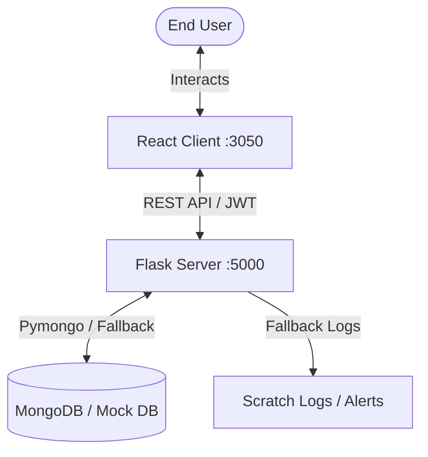

# 🌌 GALXY — Notifications Hub

Welcome to the unified documentation for the **GALXY Notifications Hub**. This project consists of a high-performance **Python/Flask Backend Service** and a modern **React Frontend Dashboard** that together manage notifications, user simulation, and alerting integrations (Telegram & Email).

---

## 🏗️ Project Architecture & Overview

The repository is organized into two primary sub-projects:

1. **[Backend Service](file:///c:/Users/sakth/OneDrive/Desktop/module%2011/backend)**: Python 3.11+ Flask web server managing notification storage, status toggles, user session emulation, and external channel linking (Telegram alerts, mock emails).
2. **[Frontend Dashboard](file:///c:/Users/sakth/OneDrive/Desktop/module%2011/frontend)**: React 18 / Vite single-page application that renders a notification center feed, real-time-like updates, profile switching controls, and channel verification pages.



---

## ⚡ Quick Start (Root-Level Execution)

To spin up the system locally, you will need two terminal windows running simultaneously.

### Step 1: Run the Backend Service

1. Navigate to the backend directory:
   ```bash
   cd backend
   ```
2. Initialize and configure the environment:
   ```powershell
   copy .env.example .env
   ```
3. Activate the virtual environment:
   ```powershell
   # Windows PowerShell
   .\.venv\Scripts\Activate.ps1
   ```
4. Install dependencies:
   ```bash
   pip install -r requirements.txt
   ```
5. Launch the backend server:
   ```bash
   python run.py
   ```
   *The Flask server runs at **`http://localhost:5000`**.*

### Step 2: Run the Frontend Dashboard

1. Open a new terminal and navigate to the frontend directory:
   ```bash
   cd frontend
   ```
2. Install Node.js packages:
   ```bash
   npm install
   ```
3. Start the local Vite server:
   ```bash
   npm run dev
   ```
   *The React application will run at **`http://localhost:3050`**.*

> [!NOTE]
> Vite is configured to use port `3050` (instead of standard `3000`) to avoid potential service-worker caching conflicts.

---

## 🐍 Backend Reference & API Docs

### Technology Stack
* **Runtime**: Python 3.11+
* **Framework**: Flask
* **Database**: MongoDB (via `pymongo` with automatic Mock Memory DB fallback)
* **Auth**: Mock JWT session tokens (`PyJWT`)

### REST API Reference

All requests must contain a valid mock token in the header unless otherwise noted:
`Authorization: Bearer <JWT_TOKEN>`

| Category | Endpoint | Method | Payload / Details |
| :--- | :--- | :--- | :--- |
| **Auth** | `/api/v1/auth/token` | `POST` | `{ "user_id": "customer1" }` → Returns Mock JWT Token |
| **Notifications** | `/api/v1/notifications` | `GET` | Query parameters: `page`, `limit`, `is_read` |
| | `/api/v1/notifications/mock-trigger` | `POST` | `{ "message": "hello", "order_id": "GLX-XYZ" }` |
| | `/api/v1/notifications/read-all` | `PATCH` | Marks all user notifications as read |
| **Telegram Link** | `/api/v1/notifications/telegram/status` | `GET`/`POST`/`DELETE` | Links/unlinks a chat; registers ID: `{ "chat_id": "12345" }` |
| | `/api/v1/notifications/telegram/verify` | `POST` | Verifies registration with `{ "code": "123456" }` |

### 🪵 Development Alert Logs
If SMTP or Telegram Bot configurations are missing from your `.env`, alerts are written to local logs:
* **Mock Emails**: [backend/scratch/mock_emails.log](file:///c:/Users/sakth/OneDrive/Desktop/module%2011/scratch/mock_emails.log)
* **Telegram Delivery**: [scratch/mock_telegram_delivery.log](file:///c:/Users/sakth/OneDrive/Desktop/module%2011/scratch/mock_telegram_delivery.log)

---

## ⚛️ Frontend Reference

### Technology Stack
* **Framework**: React 18
* **Bundler**: Vite
* **Style**: Tailwind CSS
* **Test Runner**: Vitest (jsdom environment)

### Key Configurations
* **API Target**: Configured in [src/config.js](file:///c:/Users/sakth/OneDrive/Desktop/module%2011/frontend/src/config.js) (points to backend at `http://localhost:5000`).
* **Authentication**: Token stored in `localStorage` under `galxy_token` and injected into request headers.

---

## 🧪 Running Tests

### Backend Unit Tests
Run backend suite from the `backend/` directory:
```bash
python -m unittest discover -s tests -p "test_*.py"
```

### Frontend Unit & Component Tests
Run frontend suite from the `frontend/` directory:
```bash
npm run test
```
