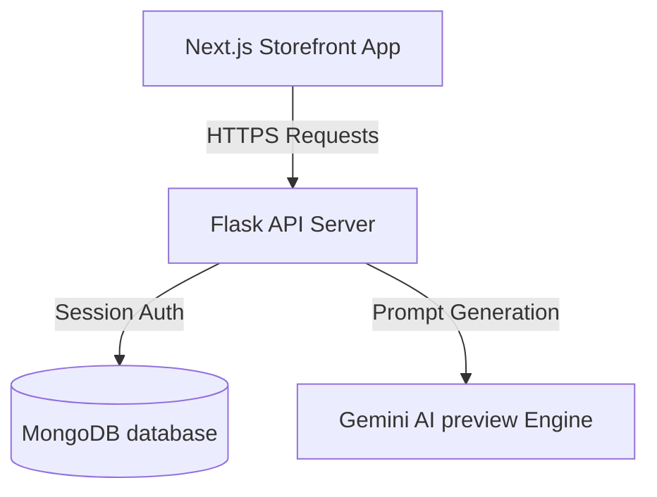

# GALXY Custom Studio storefront & API Engine

This repository contains the complete **GALXY** Custom Lighting and Craft Studio storefront. It is organized as a monorepo consisting of a modular Python Flask API backend and a responsive, high-fidelity Next.js frontend styled with the Custom Dark Neon Design System.

---

## 1. System Architecture

The monorepo structure is split into two primary folders:
1. **`/backend`**: REST API built with Flask, using MongoDB as the primary data store.
2. **`/frontend`**: Next.js App Router web application integrated with Tailwind CSS v4 and TypeScript.



---

## 2. Database Documentation (MongoDB)

The data model uses six core collections configured in [seed.py](file:///D:/review%20rating/backend/seed.py):

### 2.1 Collections Schema
1. **`users`**: Customer credentials, roles, and profiles.
2. **`admin_users`**: Role-based admins with access to moderation actions.
3. **`categories`**: Dynamic attribute schemas mapping customized fields.
4. **`products`**: Product specifications, catalog images, and rating metrics.
5. **`orders`**: Timeline history logs, quoted prices, and item configurations.
6. **`reviews`**: Verified buyer feedback, ratings, and attachments.
7. **`testimonials`**: Featured social proof logs sorted by display priority.

### 2.2 Database Indexes
To maintain optimal search performance and unique validation rules, the following indexes are generated:
- **`reviews`**:
  - `product_id` (ascending index)
  - `is_approved` (ascending index)
  - `(user_id, order_id)` (compound unique index preventing duplicate reviews)
- **`testimonials`**:
  - `(is_active, display_order)` (compound sorting index)

---

## 3. API Contract Documentation

All endpoints return standardized JSON structures conforming to the following contracts:

### 3.1 Authentication Endpoints
- **`POST /api/auth/register`**: Register a new user.
- **`POST /api/auth/login`**: Authenticate client and set refresh token cookie.
- **`POST /api/auth/refresh`**: Silent access token regeneration.
- **`POST /api/auth/logout`**: Revoke and clear browser cookies.

### 3.2 Product Catalog & Configurator
- **`GET /api/categories`**: Fetch active signages and quilled art folders.
- **`GET /api/products`**: Fetch products with search and category filtering.
- **`GET /api/products/<slug>`**: Retrieve detailed configuration settings.
- **`POST /api/configurator/price`**: Calculate base price plus attribute variations.

### 3.3 Shopping Cart & Checkout
- **`GET /api/cart`**: Retrieve active selections and warning logs.
- **`POST /api/cart/items`**: Add item configurations to cart.
- **`DELETE /api/cart/items/<id>`**: Remove item from cart.
- **`POST /api/orders/checkout`**: Submit order inquiry.

### 3.4 Reviews & Testimonials
- **`GET /api/products/<id>/reviews`**: Retrieve approved customer feedback.
- **`POST /api/products/<id>/reviews`**: Submit review (verified delivered purchase required).
- **`GET /api/testimonials`**: Retrieve active testimonials.

### 3.5 Administrative Portal
- **`GET /api/admin/reviews`**: View pending approval queue.
- **`PUT /api/admin/reviews/<id>/approve`**: Approve submission and update rating rollups.
- **`PUT /api/admin/reviews/<id>/reject`**: Log rejection feedback.
- **`POST /api/admin/reviews/<id>/promote-to-testimonial`**: Convert approved review to testimonial.
- **`PUT /api/admin/orders/<id>/quote`**: Apply final quoted price.
- **`PUT /api/admin/orders/<id>/status`**: Transition milestone status.

---

## 4. Installation & Setup Guide

### 4.1 Backend Setup
1. Navigate to `/backend` directory.
2. Install Python dependencies:
   ```bash
   pip install -r requirements.txt
   ```
3. Setup environmental variables in `/backend/.env`:
   ```env
   ENV=development
   MONGO_URI=mongodb://localhost:27017/galxy
   JWT_SECRET=super-secret-dev-key
   GEMINI_API_KEY=your_gemini_api_key
   ```
4. Seed mock categories, admin logins, and products:
   ```bash
   python seed.py
   ```
5. Start backend api:
   ```bash
   python run.py
   ```

### 4.2 Frontend Setup
1. Navigate to `/frontend` directory.
2. Restore package dependencies:
   ```bash
   npm install
   ```
3. Run the development server:
   ```bash
   npm run dev
   ```
   Open `http://localhost:3000` to interact with the storefront.

---

## 5. Deployment Guide

### 5.1 Backend Production
- Run Flask behind a WSGI server like **Gunicorn** or **uWSGI**:
  ```bash
  gunicorn -w 4 -b 0.0.0.0:5000 run:app
  ```
- Reverse proxy API routes using Nginx to handle SSL and header routing.

### 5.2 Frontend Production
- Deploy Next.js onto **Vercel** or compile locally:
  ```bash
  npm run build
  ```
  ```bash
  npm run start
  ```
