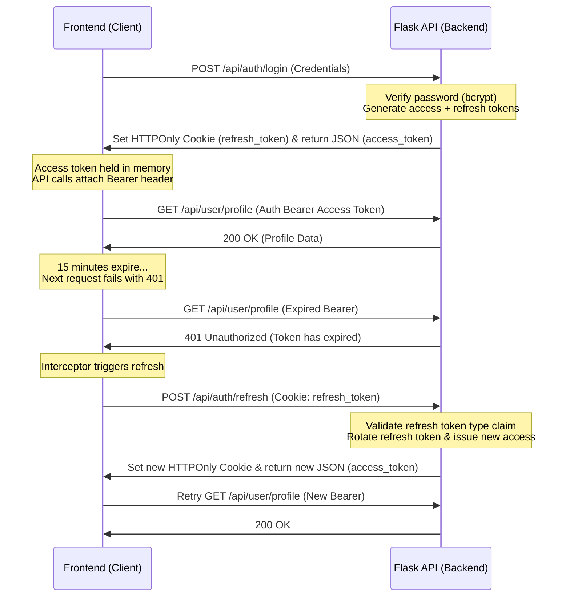

# GALXY - Module 1: Architecture Decisions & Technical Design

This document details the architectural decisions, design principles, token lifecycles, and middleware layout for Module 1 (Authentication & User Accounts). This authentication system serves as the identity backbone of the entire GALXY platform.

---

## 1. Directory Structure Rationale

We implement a service-oriented architectural skeleton on the backend and a context-driven layout on the Next.js frontend to isolate business operations, routes, models, and UI.

### 1.1 Backend Structure

```
backend/app/
├── configs/
│   └── jwt_config.py            # Central configurations for keys & expirations
├── models/
│   ├── user.py                  # User/Customer document schema & helper methods
│   ├── admin_user.py            # Administrator document schema & helpers
│   └── address.py               # Stub for Address sub-documents
├── services/
│   ├── auth_service.py          # Core customer registration, login, and refresh lifecycle
│   ├── admin_auth_service.py    # Isolated administrator verification and refresh lifecycle
│   └── user_service.py          # Customer profile lookup operations (in-scope and cross-module)
├── routes/
│   ├── auth_routes.py           # Public customer signup, login, refresh, forgot/reset routes
│   ├── admin_auth_routes.py     # Administrator access and profile routes
│   └── user_routes.py           # Authenticated user profiles and addresses
├── utils/
│   ├── auth_middleware.py       # Role decorators (@require_auth, @require_admin, etc.)
│   ├── password_helper.py       # BCrypt password hashing utilities (cost factor 12)
│   ├── token_helper.py          # JWT creation, decoding, and parsing rules
│   ├── rate_limiter.py          # In-memory IP + Email rate limiter
│   └── validators.py            # Domain-specific format validations
└── __init__.py                  # Flask Application Factory & Blueprints
```

- **Separation of Concerns**: We enforce a strict policy where route handlers (`routes/`) act as validation and HTTP interfaces only. All database operations, credential evaluations, and business workflows reside in `services/`.
- **Domain Isolation**: Customer and admin records live in separate database collections (`users` and `admin_users`) and use distinct services (`AuthService` and `AdminAuthService`) to prevent privilege escalation or overlap.

### 1.2 Frontend Structure

```
frontend/app/
├── (public)/
│   ├── login/
│   └── signup/
├── account/                     # Authenticated account zone (layout wraps with AuthGuard)
├── admin/
│   └── login/                   # Admin panel gatekeeper (layout wraps with AdminGuard)
```

---

## 2. JWT & Session Architecture

Authentication uses short-lived JSON Web Tokens (JWT) for stateless validation, backed by long-lived httpOnly cookie-based refresh tokens for secure session rotation.



### 2.1 Payload Token Specification

Every token issued incorporates the following claims:
- `sub`: The database string `ObjectId` representing the user/admin.
- `role`: The security role (`customer` or `super_admin`).
- `type`: Explicit token classification (`access` or `refresh`).
- `exp`: UTC timestamp defining token expiration.

### 2.2 JWT Payload Structure

```json
{
  "sub": "64bfad28f09d2e1c945a6c11",
  "role": "customer",
  "type": "access",
  "exp": 1690002700
}
```

### 2.3 Expiration & Security Policy
- **Access Tokens**: Expire in **15 minutes**. Held strictly in-memory (React context state) on the client to avoid XSS access.
- **Refresh Tokens**: Expire in **30 days**. Stored in a secure, `httpOnly`, `sameSite=Lax` cookie to block JavaScript-based token theft.
- **Token Rotation**: Every refresh operation requests `/api/auth/refresh` (or `/api/admin/auth/refresh`), which invalidates the used refresh token and sets a brand new rotated refresh token in the response cookie.
- **Token Type Enforcement**: The refresh endpoint strictly verifies that `payload.type == "refresh"`. A valid access token presented to the refresh endpoint is rejected to prevent silent rotation hijack.

---

## 3. Middleware Design Decisions

We implement centralized Flask decorators inside `utils/auth_middleware.py` to insulate routes and unify identity attachment.

### 3.1 `@require_auth`
- Validates the incoming HTTP request `Authorization: Bearer <token>` header.
- Decodes the token, asserts `payload.role == "customer"` and `payload.type == "access"`.
- Performs user status lookup in MongoDB; fails if the user is deactivated.
- Attaches the parsed MongoDB user document to `request.user` for the thread context.

### 3.2 `@require_admin`
- Validates the incoming HTTP request `Authorization: Bearer <token>` header.
- Decodes the token, asserts `payload.role == "super_admin"` and `payload.type == "access"`.
- Performs admin status lookup in MongoDB; fails if deactivated.
- Attaches the parsed administrator document to `request.admin` for the thread context.

### 3.3 `@optional_auth`
- Checks for an incoming bearer token. If present and valid, attaches `request.user`. If missing, invalid, or expired, silently fails and sets `request.user = None`.
- Used on public catalog or product description routes where personalized flags (e.g. `is_wishlisted`) are context-dependent but not blocking.

---

## 4. Next.js Routing Layout and Route Group Decisions

### 4.1 Plain Routing Segment `app/account` vs Route Group `(account)`

To reconcile Next.js folder diagrams with literal specifications:
- The specification explicitly names `/account/profile` and `/account/addresses` as the canonical endpoints for user management.
- In Next.js, enclosing a folder in parentheses `(account)` creates a **Route Group** which ignores the folder name in the URL, meaning `app/(account)/profile/page.tsx` resolves to `/profile`.
- **Architectural Choice**: To respect the URL path structure defined in the specifications, we use a plain routing segment: `frontend/app/account/`.
- The layout `frontend/app/account/layout.tsx` wraps all nested pages (which will contain profile and address CRUD views in the future) inside the `<AuthGuard>` wrapper. This guarantees that any URL nested under `/account` is protected behind a forced re-login redirect.
